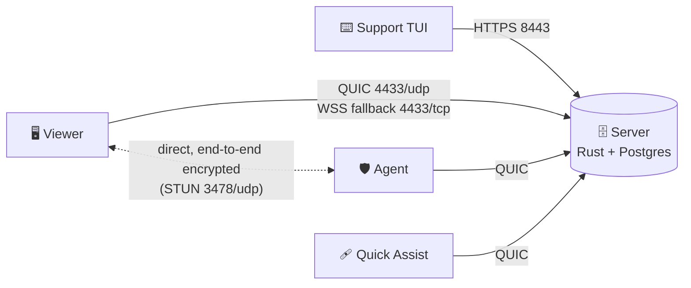

<div align="center">

<picture>
  <source media="(prefers-color-scheme: dark)" srcset="docs/assets/logo-dark.svg">
  
</picture>

### Terminal-based remote monitoring and management.

A Rust server, a Windows agent, an end-to-end encrypted remote desktop viewer,<br>
a keyboard-driven support TUI and a no-install Quick Assist client.

[](https://github.com/handclasp-raven/TetanusRMM/releases)
[](https://github.com/handclasp-raven/TetanusRMM/actions/workflows/release.yml)
[](LICENSE)
<br>


[**Quick install**](#-quick-install) · [**Features**](#-features) · [**Screenshots**](#-screenshots) · [**Quick Assist**](#-quick-assist) · [**Wiki**](https://github.com/handclasp-raven/TetanusRMM/wiki) · [**Roadmap**](#-still-to-come)

<br>


</div>

<br>

## 🚀 What's in the box

| | Component | What it does |
|:-:|---|---|
| ⌨️ | **Support TUI**<br><sub>Python + Textual</sub> | Runs anywhere you can run Python. Sign in, administrate accounts, add agents, and launch the viewer, shell console and script runner. |
| 🖥️ | **Viewer**<br><sub>Linux · macOS · Windows</sub> | End-to-end encrypted remote desktop, relayed through the server or direct when NAT allows. |
| 🗄️ | **Server**<br><sub>Rust · Docker</sub> | Keeps the connection to agents and acts as a direct-connection broker, or as a fallback relay when it has to. |
| 🛡️ | **Agent**<br><sub>Windows service</sub> | Enrollment, telemetry, signed self-update, remote desktop capture, remote shell, scripts and file transfer. |
| 🩹 | **Quick Assist**<br><sub>Windows, portable</sub> | One-time support for a machine with no agent. The user downloads one file from `https://<host>:8443/assist` and types the code the technician gives them. |



Full documentation lives in the **[wiki](https://github.com/handclasp-raven/TetanusRMM/wiki)**.

<br>

## ⚡ Quick install

On a Linux x86_64 host with `curl`:

```bash
curl -fsSL https://raw.githubusercontent.com/handclasp-raven/TetanusRMM/main/scripts/install.sh -o install.sh
bash install.sh --host rmm.example.com
```

> [!TIP]
> If the server is reached at more than one name or address, list them all (`--host rmm.example.com,10.0.0.5`, or `--host` again for each). Every one goes into the server certificate, and the first is the public address.

> [!NOTE]
> Open ports **8443/tcp**, **4433/udp**, **4433/tcp** and **3478/udp**. The script prints the admin's TOTP secret **once**, so add it to an authenticator app before closing the terminal. Then send staff to `https://<host>:8443/install` and [enroll an agent](https://github.com/handclasp-raven/TetanusRMM/wiki/Enrolling-an-Agent).

<details>
<summary><b>📥 Updating</b></summary>
<br>

The script installs the newest release: a server image from `ghcr.io/handclasp-raven/tetanusrmm`, and the agent, viewer and TUI builds from the [releases page](https://github.com/handclasp-raven/TetanusRMM/releases). Nothing is compiled on the host. To upgrade later, run this in the install directory. It backs the database up to `backups/` first:

```bash
bash scripts/install.sh --upgrade
```

See [Installing the Server](https://github.com/handclasp-raven/TetanusRMM/wiki/Installing-the-Server) for options and the manual steps.

</details>

<br>

## 💎 Features

<table>
<tr>
<td width="50%" valign="top">

#### ⌨️ A TUI built with Textual
So you know it's good. Fast, keyboard shortcuts for everything, built-in themes and a theme editor.

#### 🏎️ Speed
Remote sessions are built in Rust on the newer Windows.Graphics.Capture API (Windows 10 and 11), so the frame rate is great.

#### 🏎️💨 Speeeeed
If your NAT allows it, the server brokers a direct connection from your viewer to the agent. No middle man to slow things down.

#### 👥 Users and RBAC
Create and administrate users, and give them access to certain functions for certain groups.

#### 📦 Painless agent install
Generate a URL, open it on the remote PC, download an MSI, install. Done.

#### 🚚 Mass deployment
One MSI with a reusable, revocable key. Push it with Intune or a GPO: it installs silently and each PC enrolls itself.

#### 🩹 Quick support
Fix something for someone without an agent. Give them a link, give them a code, and you're connected.

</td>
<td width="50%" valign="top">

#### 🐚 Remote shell
Need to fire off some commands without bugging the user? Say less.

#### 📜 Scripts
Add scripts, pick target devices or a group, hit run. Easy.

#### 🔘 Quick commands
Add your own command buttons to the viewer and save yourself hitting Win+R.

#### 🔑 Lent password
User off to lunch? Ask them to type a password before they go. It stays on their PC, encrypted in memory, the agent types it for you (lock screen and UAC prompts too), and it's forgotten when the last session ends.

#### 🔐 Bitwarden in the viewer
Search your vault and have a username, password or TOTP code typed on the remote PC (lock screen and UAC too). Uses the official `bw` CLI; unlock once in the TUI for every viewer. Your master password is never kept, what's typed is end-to-end encrypted, and the audit log records which item was used (`vault.typed`), never the value.

#### 🎨 A look of its own, or yours
Everything the person at the PC sees follows Windows' light or dark mode. Put your company's name, logo and accent colour on it from the TUI (`B`).

#### 🧾 Audit logging
The server keeps a hash-chained audit of who did what, and where.

</td>
</tr>
</table>

<br>

## 📸 Screenshots

<sub>The fleet, names and addresses in these pictures are made up ("Harbor IT"). More on the wiki's <a href="https://github.com/handclasp-raven/TetanusRMM/wiki/Screenshots">Screenshots</a> page.</sub>

### The support TUI

<table>
<tr>
<td width="50%"><br><sub><b>Shell console</b> <code>s</code>: interactive PowerShell on the agent, no viewer needed.</sub></td>
<td width="50%"><br><sub><b>Script runner</b> <code>r</code>: run a script on agents and whole groups, with each agent's output.</sub></td>
</tr>
<tr>
<td width="50%"><br><sub><b>Deployment MSI</b> <code>i</code>: reusable, revocable keys for Group Policy and Intune.</sub></td>
<td width="50%"><br><sub><b>Audit log</b> <code>a</code>, with the chain check <code>v</code>.</sub></td>
</tr>
</table>

<details>
<summary><b>🎨 Themes</b>: Everforest, Kanagawa, GitHub light, green screen, or make your own</summary>
<br>
<table>
<tr>
<td width="50%"></td>
<td width="50%"></td>
</tr>
<tr>
<td width="50%"></td>
<td width="50%"></td>
</tr>
<tr>
<td colspan="2"><br><sub><b>Theme editor</b> <code>e</code></sub></td>
</tr>
</table>
</details>

### The viewer


<sub><b>Vault tab:</b> search Bitwarden and have a username, password or one-time code typed on the remote machine.</sub>

<table>
<tr>
<td width="33%"><br><sub><b>Lent password</b>, stored on the user's PC.</sub></td>
<td width="33%"><br><sub><b>Status:</b> what the agent says about its machine.</sub></td>
<td width="33%"><br><sub><b>Tools:</b> command buttons and file transfer.</sub></td>
</tr>
</table>

### What the person at the PC sees

<table>
<tr>
<td width="50%"><br><sub><b>Consent prompt</b>, with a countdown and the Ctrl+F12 escape hatch.</sub></td>
<td width="50%"><br><sub><b>Session bar</b> with its End session button. It shrinks to a pill after ten seconds.</sub></td>
</tr>
<tr>
<td width="50%"><br><sub><b>Lend a password.</b></sub></td>
<td width="50%"><br><sub><b>Tray flyout.</b></sub></td>
</tr>
</table>

<details>
<summary><b>🏷️ With your company's branding, and in light mode</b></summary>
<br>
<table>
<tr>
<td width="50%"></td>
<td width="50%"></td>
</tr>
<tr>
<td width="50%"></td>
<td width="50%"></td>
</tr>
</table>

See [Company Branding](https://github.com/handclasp-raven/TetanusRMM/wiki/Company-Branding).
</details>

<br>

## 🩹 Quick Assist

To help someone whose computer has no agent, once:

1. **Make a code.** In the TUI press `h` (Agent menu, Quick assist). It shows a page address and a six-digit code, valid for ten minutes and usable once.
2. **They download it.** The user opens `https://<host>:8443/assist`, downloads `TetanusRMM-Assist.exe` and runs it. Nothing is installed. Windows asks whether to let it run as administrator; saying no still works, but you then can't control administrator windows.
3. **Scam check.** The program shows a warning about scams (never pay anyone with gift cards or cryptocurrency) that can't be accepted for five seconds, then asks for the code.
4. **Connected.** When the code is typed, your viewer opens and the user is asked, with your username, whether to allow you. They can stop you with Ctrl+F12, and closing the program ends the session.

You get remote desktop (screen, input, clipboard) and file transfer, running as the user. There's no shell, no scripts and no command buttons, for admins too. Only the technician who made the code, and admins, can use the session. While the program stays open the machine is in the agent table, so a closed viewer can be reopened with `d`; the server forgets the machine two minutes after the program is closed. Codes, their use and the end of each session are in the audit log (`assist.create`, `assist.redeem`, `assist.end`).

> [!IMPORTANT]
> Windows only. UAC prompts, the lock screen and Ctrl+Alt+Del can't be seen or controlled (an installed agent can: it runs as a service). With the installer's own CA the user's browser warns about the page's certificate, and Windows SmartScreen warns about the unsigned program. A publicly trusted certificate on the API and a code-signing certificate remove those warnings.

<br>

## 🤔 Still to come

- [ ] **Better monitoring:** Sysmon with a sane default config, log shipping and alerting.
- [ ] **Tunnelling and remote apps:** temporary tunnels to devices inside the customer's network (admin pages, printers, etc.) from your local browser.
- [ ] **More agent platforms:** Linux (X and Wayland), macOS and older versions of Windows (currently untested, but may work).
- [ ] **Self-service password reset by email:** today all administration happens in the TUI and no email addresses are tied to user accounts.
- [ ] **Tailscale integration:** build the server with Docker Tailscale integration so it can hide on your mesh and keep external exposure to a minimum.
- [ ] **The TUI over the web:** use the TUI from a browser, via Textual.

<br>

## 📚 Documentation

| | |
|---|---|
| **Getting started** | [Installing the Server](https://github.com/handclasp-raven/TetanusRMM/wiki/Installing-the-Server) · [Enrolling an Agent](https://github.com/handclasp-raven/TetanusRMM/wiki/Enrolling-an-Agent) · [MSI Installer](https://github.com/handclasp-raven/TetanusRMM/wiki/MSI-Installer) · [Deployment MSI](https://github.com/handclasp-raven/TetanusRMM/wiki/Deployment-MSI) · [Windows Agent Service](https://github.com/handclasp-raven/TetanusRMM/wiki/Windows-Agent-Service) · [Support TUI](https://github.com/handclasp-raven/TetanusRMM/wiki/Support-TUI) |
| **Features** | [Remote Desktop](https://github.com/handclasp-raven/TetanusRMM/wiki/Remote-Desktop) · [End-to-End Encryption](https://github.com/handclasp-raven/TetanusRMM/wiki/End-to-End-Encryption) · [Direct Connections](https://github.com/handclasp-raven/TetanusRMM/wiki/Direct-Connections) · [Adaptive Bitrate](https://github.com/handclasp-raven/TetanusRMM/wiki/Adaptive-Bitrate) · [Consent and Notifications](https://github.com/handclasp-raven/TetanusRMM/wiki/Consent-and-Notifications) · [Lent Password and Bitwarden](https://github.com/handclasp-raven/TetanusRMM/wiki/Lent-Password-and-Bitwarden) · [Quick Assist](https://github.com/handclasp-raven/TetanusRMM/wiki/Quick-Assist) · [Remote Shell, Scripts and File Transfer](https://github.com/handclasp-raven/TetanusRMM/wiki/Remote-Shell-Scripts-and-File-Transfer) · [Telemetry](https://github.com/handclasp-raven/TetanusRMM/wiki/Telemetry) · [Company Branding](https://github.com/handclasp-raven/TetanusRMM/wiki/Company-Branding) |
| **Reference** | [Connectivity](https://github.com/handclasp-raven/TetanusRMM/wiki/Connectivity) · [Signed Updates](https://github.com/handclasp-raven/TetanusRMM/wiki/Signed-Updates) · [Configuration](https://github.com/handclasp-raven/TetanusRMM/wiki/Configuration) · [Access Control](https://github.com/handclasp-raven/TetanusRMM/wiki/Access-Control) · [HTTPS API](https://github.com/handclasp-raven/TetanusRMM/wiki/HTTPS-API) · [Metrics](https://github.com/handclasp-raven/TetanusRMM/wiki/Metrics) |
| **Development** | [Architecture](https://github.com/handclasp-raven/TetanusRMM/wiki/Architecture) · [Development Setup](https://github.com/handclasp-raven/TetanusRMM/wiki/Development-Setup) · [Testing](https://github.com/handclasp-raven/TetanusRMM/wiki/Testing) |

The support TUI has its own README: [tui/README.md](tui/README.md).

<br>

## 🛠️ Development quick start

Requires Docker and a Rust toolchain.

```bash
cargo run -p server -- gen-certs
mkdir -p updates
docker compose up --build -d
curl --cacert dev-certs/ca.crt https://localhost:8443/api/health
```

<details>
<summary><b>Checks</b></summary>

```bash
cargo fmt --all --check
cargo clippy --workspace --all-targets -- -D warnings
cargo test --workspace        # needs a running Docker daemon
```

</details>

<br>

## 📄 License

TetanusRMM is released under the [GNU General Public License v3.0](LICENSE).

<div align="center">
<br>
<picture>
  <source media="(prefers-color-scheme: dark)" srcset="docs/assets/logo-dark.svg">
  
</picture>
</div>
